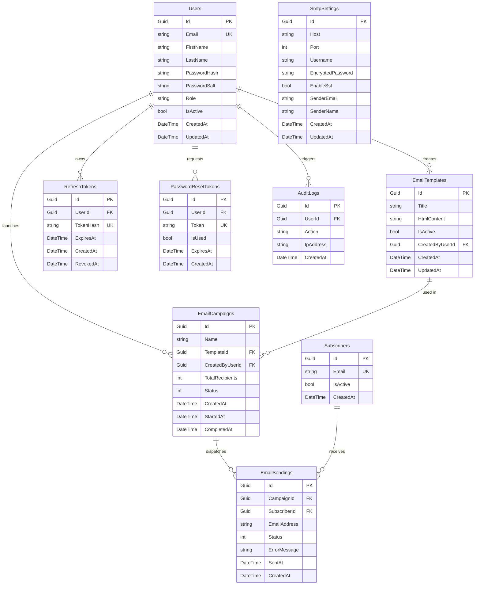

# MailPulse — Entity-Relationship (ER) Diagram

Bu belge, **MailPulse** E-posta Pazarlama & Analitik Platformu'nun veritabanı şemasını, varlıkları (Entities), birincil anahtarlarını (PK), yabancı anahtarlarını (FK) ve kardinalite ilişkilerini tanımlamaktadır.

---

## 📐 ER Diyagramı (Mermaid)

---

## 🔗 Tablo İlişkileri & Silme Davranışları (Delete Behaviors)

| Birincil Tablo (Parent) | Yabancı Tablo (Child) | Yabancı Anahtar (FK) | Silme Davranışı (Delete Behavior) | Açıklama |
| :--- | :--- | :--- | :--- | :--- |
| **Users** | `EmailTemplates` | `CreatedByUserId` | `Restrict` | Kullanıcı silinirse oluşturduğu şablonlar silinmez. |
| **Users** | `EmailCampaigns` | `CreatedByUserId` | `Restrict` | Kullanıcı silinirse oluşturduğu kampanyalar korunur. |
| **Users** | `RefreshTokens` | `UserId` | `Cascade` | Kullanıcı silindiğinde tüm oturum token'ları silinir. |
| **Users** | `PasswordResetTokens` | `UserId` | `Cascade` | Kullanıcı silindiğinde tüm şifre sıfırlama token'ları silinir. |
| **Users** | `AuditLogs` | `UserId` | `SetNull` | Kullanıcı silinirse denetim logundaki kullanıcı ID'si null yapılır. |
| **EmailTemplates** | `EmailCampaigns` | `TemplateId` | `Restrict` | Kampanyada kullanılan şablonun kazaen silinmesi engellenir. |
| **EmailCampaigns** | `EmailSendings` | `CampaignId` | `Cascade` | Kampanya silindiğinde tüm gönderim günlükleri silinir. |
| **Subscribers** | `EmailSendings` | `SubscriberId` | `SetNull` | Abone silinirse geçmiş e-posta gönderim kaydı korunur, alıcı ID'si null yapılır. |

